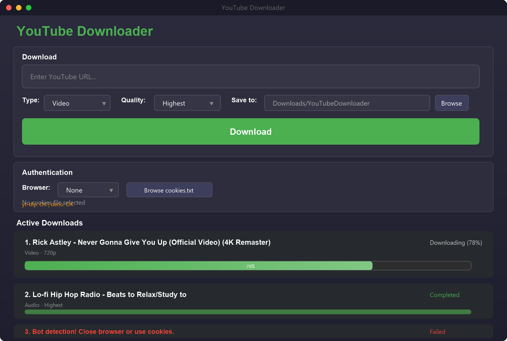
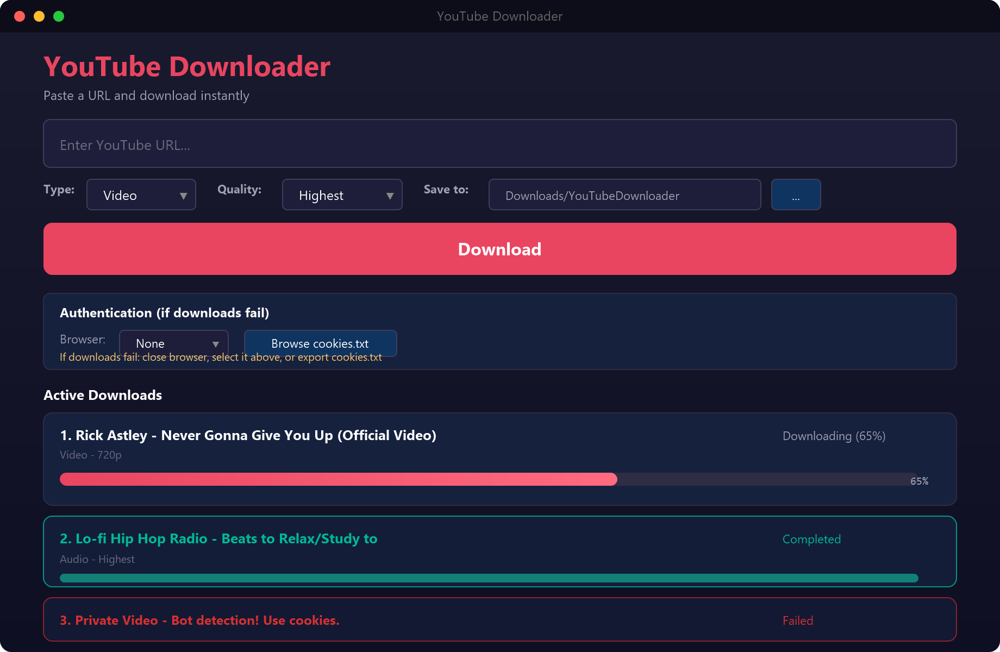

# YouTube Downloader

A modern YouTube video/audio downloader with a clean GUI, built with Python, PySide6, and yt-dlp.



## Features

- **Instant Downloads** — paste a URL and download immediately, no queue needed
- **Multiple Formats** — Video (MP4) or Audio (MP3)
- **Quality Selection** — Highest, 720p, 480p, 360p, 240p, 144p, Lowest
- **Concurrent Downloads** — download multiple videos at the same time
- **Real-time Progress** — live progress bars and status updates
- **Dark Theme** — modern dark UI
- **Browser Cookies** — built-in support for YouTube authentication
- **URL Cleanup** — automatically strips playlist parameters

## Requirements

- **Python 3.10+**
- **yt-dlp** — YouTube downloader engine
- **deno** — JavaScript runtime (required for YouTube's bot detection)
- **ffmpeg** — for merging video/audio streams
- **PySide6** — GUI framework

## Installation

### 1. Clone the repository

```bash
git clone https://github.com/mmdMadi/YouTubeDownloader.git
cd YouTubeDownloader
```

### 2. Install Python dependencies

```bash
pip install -r requirements.txt
```

### 3. Install deno (required)

**Windows (PowerShell as admin):**
```powershell
winget install DenoLand.Deno
```

**Mac/Linux:**
```bash
curl -fsSL https://deno.land/install.sh | sh
```

### 4. Install ffmpeg

**Windows:**
```powershell
winget install FFmpeg
```

**Mac:**
```bash
brew install ffmpeg
```

**Linux:**
```bash
sudo apt install ffmpeg
```

### 5. Run the app

```bash
python main.py
```

## Alternative: Tkinter Version

A lighter version using tkinter (no PySide6 install needed) is also included:



```bash
python main_tkinter.py
```

## Authentication

YouTube now requires authentication for some videos to prevent bot detection.

### Option 1: Browser Cookies

1. **Close your browser completely**
2. Select your browser from the dropdown in the app
3. Download — cookies are extracted automatically

### Option 2: Cookies File

1. Install the **"Get cookies.txt LOCALLY"** browser extension ([Chrome](https://chrome.google.com/webstore/detail/get-cookiestxt-locally/cclelndahbckbenkjhflpdbgdldlbecc) / [Firefox](https://addons.mozilla.org/en-US/firefox/addon/cookies-txt/))
2. Go to youtube.com while logged in
3. Click the extension icon and export cookies
4. In the app, click **"Browse cookies.txt"** and select the exported file

> **Important:** Use the cookies file that contains `LOGIN_INFO`, `SID`, and `__Secure-1PSID` cookies — not just visitor cookies.

## Project Structure

```
YouTubeDownloader/
├── main.py                 # PySide6 GUI (main version)
├── main_tkinter.py         # Tkinter GUI (lightweight alternative)
├── requirements.txt        # Python dependencies
└── README.md
```

## How It Works

1. **yt-dlp CLI** — the app calls yt-dlp as a subprocess (more reliable than the Python API for YouTube's latest anti-bot measures)
2. **deno** — solves YouTube's JavaScript challenges that verify you're not a bot
3. **ffmpeg** — merges separate video and audio streams into a single MP4 file

## Troubleshooting

| Problem | Solution |
|---------|----------|
| "Bot detection" error | Use browser cookies (close browser first) or export a cookies.txt |
| "deno not found" | Install deno: `winget install DenoLand.Deno` (restart terminal after) |
| "ffmpeg not found" | Install ffmpeg: `winget install FFmpeg` |
| No audio in downloaded video | Install or update ffmpeg |
| Download is slow | Try a different quality setting or check your internet |

## License

MIT License
